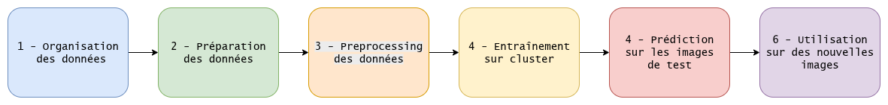

# Tutorial_nnUNet

<p align="center">
  
</p>  

----

## 📚 Sommaire

- [🧰 Prérequis – Installation de nnU-Net v2](#-prérequis--installation-de-nnu-net-v2)
- [Étape 0️⃣ – Préparation des masques](#étape-0️⃣--préparation-des-masques)
- [Étape 1️⃣ - Organisation des données](#étape-1️⃣---organisation-des-données)
- [Étape 2️⃣ - Préparation des données](#étape-2️⃣---préparation-des-données)
- [Étape 3️⃣ - Preprocessing des données](#étape-3️⃣---preprocessing-des-données)
- [Étape 4️⃣ - Entraînement sur cluster](#étape-4️⃣---entraînement-sur-cluster)
- [Étape 5️⃣ - Prédiction sur les images de test](#étape-5️⃣---prédiction-sur-les-images-de-test)
- [Étape 6️⃣ - Utilisation sur de nouvelles images](#étape-6️⃣---utilisation-sur-de-nouvelles-images)

---

# 🧰 Prérequis – Installation de nnU-Net v2

```
# Cloner le dépôt
git clone https://github.com/MIC-DKFZ/nnUNet.git
cd nnUNet

# Installer les dépendances
pip install -e .
```
---
# Étape 0️⃣ – Préparation des masques

Avant d’utiliser nnU-Net, il faut que les masques de segmentation soient bien formatés, avec les classes correctement étiquetées :  
⚠️ le label 0 correspond au background (obligatoire pour nnU-Net)  

Pour réaliser la partie background, il faut aller dans la section *Data* de 3D Slicer puis, clique droit sur le masque et cliquer sur *Export visible segments to binary label map*.    
Une fois cela fait, aller dans la section *Segment editor* et dans *Source Volume*, chargé ce nouveau masque binaire qui vient dêtre généré :      
<p align="center">
  
</p>  

Ensuite, utiliser l'outil *Threshold* et cliquer sur une zone qui ne contient pas de pixels appartenant au masque (dans la zone verte sur l'exemple) et cliquer sur *Apply*.    
Pour finir, renommer ce nouveau segment *background*. 

---
# Étape 1️⃣ - Organisation des données
La première étape une fois que nnUNet est clôné et compilé est l'organisation des données afin de respecter le schéma souhaité par nnUNet. Il faut créer 3 dossiers :
```
3D_UNet
└── nnUNet_results/
└── nnUNet_raw/
└── nnUNet_preprocessed/  
```
- **nnUNet_results** : va contenir les résultats des entraînements (le laisser vide pour l'instant)  
- **nnUNet_preprocessed** : va contenir les images preprocessed par nnUNet (le laisser vide également)  
- **nnUNet_raw** : va contenir les données utilisées pour l'entraînement et c'est ce dossier qui va nous intéresser dans un premier temps puisque la disposition des données doit se faire de cette façon :  
```
nnUNet_raw/  
└── DatasetXXX_name/  
    ├── imagesTr/  
    │   ├── 001_0000.nrrd  # images de training   
    │   ├── 002_0000.nrrd
    │   ├── ...
    ├── labelsTr/  
    │   ├── 001.nrrd       # masques de 3D Slicer  
    │   ├── 002.nrrd
    │   ├── ...
    ├── imagesTs/  
    │   ├── 008.nrrd       # images de test  
    │   ├── 009.nrrd
    │   ├── ...
    ├── dataset.json       # fichier de configuration
```

⚠️ Le nom du couple image/masque est important. Exemple : l'image 001_0000.nrrd doit être associée au masque 001.nrrd.  
⚠️ L'extension **.nnrd** est importante. Il est possible de converitr une image DICOM en .nrrd en la chargant dans 3D SLicer et en exportant l'image, de choisir l'extension souhaitée.   
⚠️ La séparation entre images de training et images de test se fait avec un ratio de 80/20% pour maximiser les performances.

## Écriture du fichier de configuration :
### Exemple d'un fichier de configuration
```
{
    "name": "Dataset00X_name",
    "description": "Test_Segmentation",
    "tensorImageSize": "3D",
    "reference": "",
    "licence": "",
    "release": "1.0",
    "labels": {
        "background" : 0,
        "airways" : 1
    },
    "numTraining": 4,
    "numTest": 2,
    "training": [
        {"image": "./imagesTr/001_0000.nrrd", "label": "./labelsTr/001.nrrd"},
        {"image": "./imagesTr/002_0000.nrrd", "label": "./labelsTr/002.nrrd"},
        {"image": "./imagesTr/003_0000.nrrd", "label": "./labelsTr/003.nrrd"},
        {"image": "./imagesTr/004_0000.nrrd", "label": "./labelsTr/004.nrrd"},
    ],
    "test": [
        {"image": "./imagesTs/0_0000.nrrd"},
        {"image": "./imagesTs/012_0000.nrrd"}

    ],
    "channel_names": {
    "0": "CT"
    },
    "file_ending": ".nrrd"
}

```
- **name** : nom du dataset d'images (le même que celui présent dans le dossier **nnUNet_raw**)
- **description** : indication sur la tâche de segmentation (pas nécessaire)
- **tensorImageSize** : laisser 3D pour les images du SPCCT
- **labels** : laisser le *background* en 0 et ensuite, lister sans ordre d'importance les autres classes du masques (parenchyme, lobes etc)
- **numTraining** : nombre d'images de training présentes dans imagesTr
- **numTest** : nombre d'images de test présentes dans imagesTs
- **training** : liste des couples image/masque du dataset
- **test** : liste des images présentes dans imagesTs
- **channel_names** : laisser *CT* pour les images du SPCCT
- **file_ending** : laisser *.nrrd" si les images sonts exportés en *.nrrd*

---
# Étape 2️⃣ - Préparation des données
⚠️ **AVANT** de continuer, il faut **export** les chemins vers ces dossiers dans l'environement qui va executer la commande pour effectuer le preprocessing.  
export nnUNet_raw="path/to/nnUNet_raw"
export nnUNet_preprocessed="path/to/nnUNet_preprocessed"
export nnUNet_results="path/to/nnUNet_results"

Une fois que les données sont organisées de la bonne façon. Il faut executer un script **correct.py** qui permet de corriger le nom et le numéro des classes.  
Comme évoqué précédemment, background **DOIT** avoir le label 0. Ensuite, l'ordre des classes n'importe pas.  

Le script **correct.py** permet de faire cela :
```
python3 correct.py --h
usage: correct.py [-h] --images_dir IMAGES_DIR --labels_dir LABELS_DIR --classes CLASSES [CLASSES ...]

Remappe les labels et redimensionne les segmentations.

optional arguments:
  -h, --help            show this help message and exit
  --images_dir IMAGES_DIR
                        Chemin vers le dossier des images
  --labels_dir LABELS_DIR
                        Chemin vers le dossier des labels
  --classes CLASSES [CLASSES ...]
                        Liste des classes utilisées dans le mapping

- **images_dir** : le chemin vers les images qui vont être utilisées pour le training (avec le bon label pour chaque image ex: 001_0000.nrrd, ....)  
- **labels_dir** : le chemin vers les masques qui vont  être utilisés pour le training (avec le bon label pour chaque image ex: 001.nrrd, ....)  
- **classes** : liste des noms des classes sans la classe **background**

De ce fait un exemple d'utilisation :
python3 correct.py --images_dir /path/to/images --labels_dir /path/to/masks --classes CLASSE1 CLASSE2


Une fois que le script a été executé, on peut passer au preprocessing  
```

---
# Étape 3️⃣ - Preprocessing des données

Pour cette étape, nous allons utilisé **nnUNetv2_plan_and_preprocess** :
```
nnUNetv2_plan_and_preprocess -d XXX --verify_dataset_integrity --clean -c 3d_fullres
```

- **-d** : ce paramètre correspond à l'ID du dataset dejà évoqué lors de la création du fichier de configuration  

Une fois que le script est executé le dossier **nnUNet_preprocessed** ne devrait plus être vide. On peut passer à l'entraînement.

---
# Étape 4️⃣ - Entraînement sur cluster

La première étape est de copier les données sur le cluster :
```
scp -r /path/to/directory name@linux1.dg.creatis.insa-lyon.fr:/path/on/cluster
```

- **/path/to/directory** : mettre le chemin vers le dossier local contenant *nnUNet_raw*, *nnUNet_preprocessed* et *nnUNet_results*    
- **name** : nom de famille de l'utilisateur  
- **/path/on/cluster** : endroit où vous voulez stocker le dossier sur le cluster  

Une fois que les données sont sur le cluster nous allons pouvoir entraîner les modèles grâce à un fichier **.pbs**.

## Écriture du fichier **.pbs** :
Après s'être connecté en *ssh* au cluster, on puet écrire le script qui va executer l'entraînement :
### Exemple d'un fichier de **.pbs** :
```
#!/bin/sh
#PBS -l walltime=5:00:00
#PBS -N Nom
#PBS -l nodes=1:ppn=4:gpus=2
#PBS -q gpu
#PBS -l mem=64gb
#PBS -o Output0.out
#PBS -e Errors0.err
#PBS -m e
#PBS -M florian.davaux@creatis.insa-lyon.fr

export nnUNet_raw="path/to/nnUNet_raw"
export nnUNet_preprocessed="path/to/nnUNet_preprocessed"
export nnUNet_results="path/to/nnUNet_results"

conda activate env

nnUNetv2_train DatasetXXX_name 3d_fullres ID
```

- **premier paramètre** : le temps que l'on souhaite accordé à l'entraînement du modèle  
- **deuxième paramètre** : le nom qui va figurer dans la liste des codes lancés sur le cluster
- **troisième paramètre** : le nombre de noeuds et gpus qu'on souhiate réserver.  
**Conseil : minimum 2 gpus et 2 ppn pour un entraînement nnU-Net**  
- **quatrième paramètre** : le fait qu'on veuille reserver un ou plusieurs gpus  
- **cinquième paramètre** : l'allocation de mémoire.  
**Conseil : minimum 32gb pour un entraînement nnU-Net**
- **sixième paramètre** : fichier qui va contenir les messages de sortie
- **septième paramètre** : fichier qui va contenir les messages d'erreur

Ensuite, il faut **export** les chemins vers les dossiers *nnUNet_raw, nnUNet_preprocessed, nnUNet_results*.  
On active l'environnement.  
On lance la commande de training **nnUNet_train** :  
```
nnUNetv2_train DatasetXXX_name 3d_fullres ID
```

- **DatasetXXX_name** : nom du dataset
- **3d_fullres** : pour utiliser l'architexture 3D disponible
- **ID** : l'ID du fold qu'on veut entraîner sachant que nnU-Net utilise de la cross validation sur 5 folds.  

Pour voir l'avancement du script dans le cluster, on peut taper :
```
qstat -u name
```

- **name** : nom de l'utilisateur

Cette commande permet d'afficher l'état d'avanceemnt du script lancé.  

---

# Étape 5️⃣ - Prédiction sur les images de test
Une fois que les 5 modèles des 5 folds sont terminés, on peut recopier les données sur l'ordinateur en local :  

```
rsync -avzP name@linux1.dg.creatis.insa-lyon.fr:/path/on/cluster/to/nnUNet_results /path/to/directory/3D_UNet
```

- **name** : nom de famille de l'utilisateur  
- **/path/on/cluster/to/nnUNet_results** : endroit où est stocké *nnUNet_results* sur le cluster  
- **/path/to/directory/3D_UNet** : mettre le chemin vers le dossier local qui contient les dossiers *nnUNet_raw, nnUNet_preprocessed, nnUNet_results*  

Maintenant que les résultats sont stockés en local, on va pouvoir utiliser la prédiction des modèles :
```
nnUNetv2_predict -i /path/to/imagesTs -o DIR -d XXX -c 3d_fullres -f ID
```

- **-i** : chemin vers les images de test
- **-o** : chemin du dossier qui va stocker les prédictions
- **-c** : architecture utilisée pour l'entraînement  
- **-d** : ce paramètre correspond à l'ID du dataset dejà évoqué lors de la création du fichier de configuration  
- **-f** : l'ID du fold qu'on veut entraîner sachant que nnU-Net utilise de la cross validation sur 5 folds.

Si on veut utiliser l'*ensembling* du nnU-Net, c'est à dire le fait de faire 5 prédictions différentes et finir par une moyenne des prédictions il faut lancer cette commande :
```
nnUNetv2_predict -i /path/to/imagesTs -o DIR -d XXX -c 3d_fullres -f 0 1 2 3 4
```
Ce qui change ici c'est que derriere ```-f```, on met ```0 1 2 3 4``` pour spécifier de faire la prédiction avec les 5 modèles et non un suel et unique.

# Étape 6️⃣ - Utilisation sur de nouvelles images

La vraie utilité d'un modèle pré-entrainé est de l'utiliser sur de nouvelles images.   
Il est possible d'exporter les modèles sous format zip. Il contiendront deux fichier, le fichier *.pth* contenant les poids du modèle et le fichier *dataset.json* du fold associé. Puisqu'il est possible **UNIQUEMENT** d'exporter un fold choisi entre ceux entraînés (0, 1 ,2 ,3 ou 4).    

⚠️ Cependant, le fait de lancer une prédiction sur un nouvel ordinaeur n'est pas encore disponible.  
De ce fait, si on veut lancer une prédiction en local il va falloir modifier deux choses. Le dossier *imagesTs* ainsi que le fichier *dataset.json*.  

En effet, pour l'instant, le modèle s'attend à ce que son nombre de prédiction soit celui noté dans le fichier *dataset.json*. L'astuce va être de supprimer les images contenues dans *imagesTs*, de placer la ou les nouvelles images que l'on veut prédire et pour finir, ajuster le nombre de nouvelles images à predir dans le fichier *dataset.json*.  

## Exemple prediction sur nouvelles images :
Exemple d'un modèle entraîné et du fichier json associé : 
```
3DUNet_LungsAirways
├── nnUNet_preprocessed
│   └── Dataset001_lungsairways
│       ...
├── nnUNet_raw
│   └── Dataset001_lungsairways
│       ├── dataset.json
│       ├── imagesTr
│       │   ├── 001_0000.nrrd
│       │   ├── 002_0000.nrrd
│       │   ├── 003_0000.nrrd
│       │   ├── 004_0000.nrrd
│       │   ├── 005_0000.nrrd
│       │   ├── 006_0000.nrrd
│       │   ├── 007_0000.nrrd
│       │   ├── 008_0000.nrrd
│       │   ├── 009_0000.nrrd
│       │   ├── 010_0000.nrrd
│       │   ├── 011_0000.nrrd
│       │   ├── 012_0000.nrrd
│       │   ├── 013_0000.nrrd
│       │   └── 014_0000.nrrd
│       ├── imagesTs
│       │   ├── 015_0000.nrrd
│       │   └── 016_0000.nrrd
│       ├── labelsTr
│       │   ├── 001.nrrd
│       │   ├── 002.nrrd
│       │   ├── 003.nrrd
│       │   ├── 004.nrrd
│       │   ├── 005.nrrd
│       │   ├── 006.nrrd
│       │   ├── 007.nrrd
│       │   ├── 008.nrrd
│       │   ├── 009.nrrd
│       │   ├── 010.nrrd
│       │   ├── 011.nrrd
│       │   ├── 012.nrrd
│       │   ├── 013.nrrd
│       │   ├── 014.nrrd
│       │   ├── 015.nrrd
│       │   └── 016.nrrd
├── nnUNet_results
│   └── Dataset001_lungsairways
│       └── nnUNetTrainer__nnUNetPlans__3d_fullres
│           ├── dataset_fingerprint.json
│           ├── dataset.json
│           ├── fold_0
│           │   ├── checkpoint_final.pth
│           │   ├── checkpoint_latest.pth
│           │   ├── debug.json
│           │   ├── progress.png
│           │   ├── training_log_2025_3_20_09_10_23.txt
│           ├── fold_1
│           │   ├── checkpoint_final.pth
│           │   ├── checkpoint_latest.pth
│           │   ├── debug.json
│           │   ├── progress.png
│           │   ├── training_log_2025_3_20_09_10_23.txt
│           ├── fold_2
│           │   ├── checkpoint_final.pth
│           │   ├── checkpoint_latest.pth
│           │   ├── debug.json
│           │   ├── progress.png
│           │   ├── training_log_2025_3_20_09_10_56.txt
│           ├── fold_3
│           │   ├── checkpoint_final.pth
│           │   ├── checkpoint_latest.pth
│           │   ├── debug.json
│           │   ├── progress.png
│           │   ├── training_log_2025_3_21_09_35_31.txt
│           ├── fold_4
│           │   ├── checkpoint_final.pth
│           │   ├── checkpoint_latest.pth
│           │   ├── debug.json
│           │   ├── progress.png
│           │   ├── training_log_2025_3_21_09_36_54.txt
│           └── plans.json
```

Fichier **dataset.json** :
```
{
    "name": "Dataset001_lungsairways",
    "description": "Lungs and Airways segmentation dataset",
    "tensorImageSize": "3D",
    "reference": "",
    "licence": "",
    "release": "1.0",
    "labels": {
        "background" : 0,
        "lungs" : 1,
        "airways" : 2
    },
    "numTraining": 14,
    "numTest": 2,
    "training": [
        {"image": "./imagesTr/001_0000.nrrd", "label": "./labelsTr/001.nrrd"},
        {"image": "./imagesTr/002_0000.nrrd", "label": "./labelsTr/002.nrrd"},
        {"image": "./imagesTr/003_0000.nrrd", "label": "./labelsTr/003.nrrd"},
        {"image": "./imagesTr/004_0000.nrrd", "label": "./labelsTr/004.nrrd"},
        {"image": "./imagesTr/005_0000.nrrd", "label": "./labelsTr/005.nrrd"},
        {"image": "./imagesTr/006_0000.nrrd", "label": "./labelsTr/006.nrrd"},
        {"image": "./imagesTr/007_0000.nrrd", "label": "./labelsTr/007.nrrd"},
        {"image": "./imagesTr/008_0000.nrrd", "label": "./labelsTr/008.nrrd"},
        {"image": "./imagesTr/009_0000.nrrd", "label": "./labelsTr/009.nrrd"},
        {"image": "./imagesTr/010_0000.nrrd", "label": "./labelsTr/010.nrrd"},
        {"image": "./imagesTr/011_0000.nrrd", "label": "./labelsTr/011.nrrd"},
        {"image": "./imagesTr/012_0000.nrrd", "label": "./labelsTr/012.nrrd"},
        {"image": "./imagesTr/013_0000.nrrd", "label": "./labelsTr/013.nrrd"},
        {"image": "./imagesTr/014_0000.nrrd", "label": "./labelsTr/014.nrrd"}
    ],
    "test": [
        {"image": "./imagesTs/015_0000.nrrd"},
        {"image": "./imagesTs/016_0000.nrrd"}

    ],
    "channel_names": {
    "0": "CT"
    },
    "file_ending": ".nrrd"
}
```

Dans cet exemple, il y a 2 images de tests comme indiqué dans le fichier *.json* dnas la valeur **numTest** et **test**.  

Si on souhaite prédire d'autres images, il faut donc vider le dossier **imagesTs**, mettre les images qui doivent être prédites dnas **imagesTs**, et modifier en conséquence **numTest** et **test** dans le fichier *dataset.json*.  

Enuite on peut réutiliser la commande ```nnUNet_predict```.
